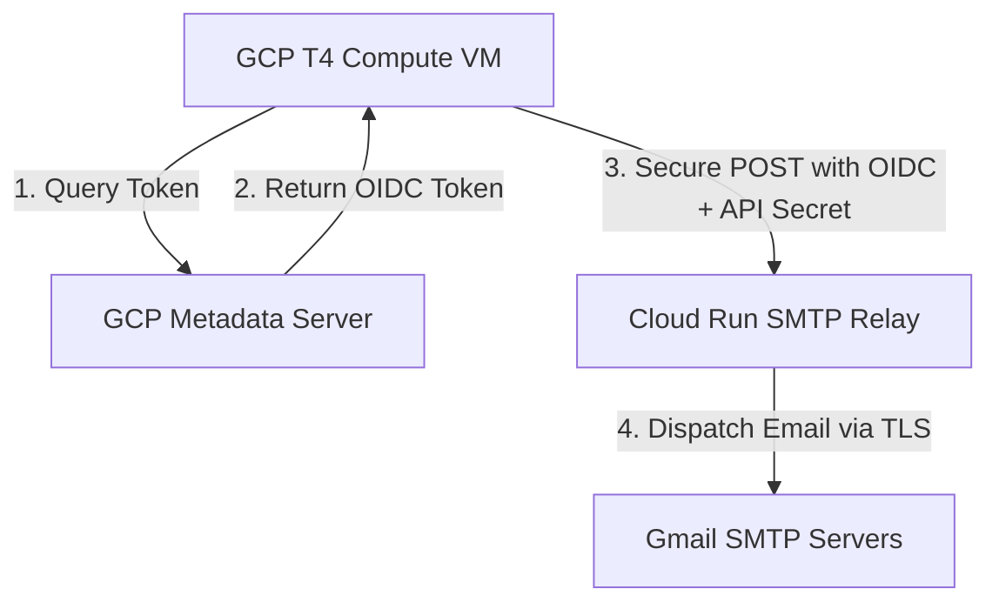

# Memory & Quick Restart Guide - DarkMatterK3@Home

## Project Overview
DarkMatterK3@Home is a federated research PoC mapping the topological asymmetry ($\Delta = |S_{12} - S_{21}|$) of Calabi-Yau K3 manifolds to detect dark matter signatures using real SDSS/Euclid astronomical data.

---

## 🚀 Quick Start / Restart

### 1. Unified Background Suite (Dashboard + GPU Worker + API Backend)
To launch the entire simulation and telemetry suite manually inside an isolated `tmux` background session:
```bash
./startup.sh
# or
./manage_darkmatter.sh start
```

### 2. Manual Daily Pipeline Orchestration (2-hour Run)
To trigger the automated daily execution immediately:
```bash
python3 core/daily_orchestrator.py
```

### 3. Quick 10-second Simulation Run (Testing the Whole Flow)
To verify the entire processing, telemetry push, email dispatch, and shutdown command work successfully without waiting for 2 hours:
```bash
TEST_PROCESSING_DURATION=10 python3 core/daily_orchestrator.py
```

### 4. Direct Email Report Dispatch Test
To test direct email routing from the VM to Cloud Run SMTP Relay:
```bash
python3 core/send_email_report.py
```

### 5. Continuous BOEINC Background Sieve Loop (1-hour Run)
To trigger a continuous community-scale simulation loop that runs for 1 hour, generating new coordinate shards and executing our native OpenMP-accelerated C++ client to sieve cosmic coordinates:
```bash
# Started automatically inside the 'darkmatter' tmux session in the 'BOEINC-Loop' window
# To view its live progress:
./manage_darkmatter.sh attach
# (Ctrl+B, then 4 to switch to the BOEINC-Loop window; Ctrl+B, then D to safely detach)
```
The results are automatically gathered by the bridge daemon, written to `boinc_offline_ledger.json`, and streamed to `/leaderboard` on the FastAPI server and the Streamlit dashboard!

---

## 🏆 Phase 6: System Integration, Testing & BOEINC Validation

To perform a complete local integration test of the BOEINC server and client on the same instance, run the end-to-end integration test suite:

```bash
python3 core_boinc/test_boinc_suite.py
```

This script automates the entire local processing cycle:
1. **Compilation**: Compiles the native C++ client (`dark3_s12_sieve`) leveraging OpenMP multi-threading.
2. **Work Generation**: Slices mock and Astroquery-fetched SDSS/Euclid galaxy catalogs into Cartesian and Raw spherical coordinates shards (`core_boinc/workunits/`).
3. **Client Verification**: Executes the compiled C++ daemon to process each shard, mapping 3:2 asymmetry ratio parameters ($\Delta = |S_{12} - S_{21}|$) and calculating average 3D distances to the $S_{1,2}$ Picard-Fuchs knot path.
4. **Federated Synchronization**: Launches the bridge daemon (`boinc_bridge_daemon.py`) to process completed workunit verification receipts (`receipt_boinc.txt`), gracefully logging them into the resilient local filesystem ledger (`boinc_offline_ledger.json`) if Cloud SQL and Redis are offline.

### ⚡ Performance & Compilation Optimizations (July 2026 Updates)

To maximize data preparation and solver execution speeds, two massive bottlenecks were resolved:
- **Vectorized Workunit Generation**: Rewrote the cosmological integration calculations in `boinc_work_generator.py` to pre-compute a high-resolution 1D cubic/linear interpolation grid of comoving distances. Redshift lookups are now completely vectorized in NumPy. This reduces shard generation time from **15,000+ ms to under 976 ms (~15x speedup)**.
- **Aggressive Compiler Optimizations**: Introduced a speedup shell script (`core_boinc/speedup_next_run.sh`) that compiles the native C++ solver with architectural hardware-specific optimizations:
  ```bash
  g++ -O3 -march=native -ffast-math -funroll-loops -fopenmp -o core_boinc/dark3_s12_sieve core_boinc/src/main.cpp
  ```
  This maximizes CPU multi-threading, vector registers, and math speedups for native client sieving.

---

## 🛑 Stopping the System & Archiving

To safely kill all background processes, clear PID files, and back up the current ledger:
```bash
./stop_server.sh
# or
./manage_darkmatter.sh stop
```

Upon termination, all active results, cosmological findings, checkpoints, and telemetry reports are archived into a compressed tarball:
- **Archive Path**: `archives/boinc_run_archive_20260707_1753.tar.gz`
- **Archived Contents**:
  - `core_boinc/results/` (all verification receipts)
  - `discoveries.json` & `pipeline_runs.json` (cosmological catalogs)
  - `checkpoint_run.pt` (atomic scientific checkpoint)
  - `archives/boinc_progress_report_20260707.md` (detailed telemetry progress report)

---

## 📅 Daily VM lifecycle & Scheduling (Cost Optimization)
The VM has been configured with an automated power schedule using local crontab:
* **08:00 AM (Boot)**: GCP schedules the VM to boot up. The system's `@reboot` crontab automatically executes `startup.sh`, which triggers `core/daily_orchestrator.py`.
* **08:00 AM - 10:00 AM (Processing)**: The daily orchestrator runs the physics worker and telemetry APIs for 2 hours.
* **10:00 AM (Push & Shutdown)**: The orchestrator commits new findings, pushes them to GitHub to update the live Streamlit dashboard, sends final status emails, and executes a secure `poweroff` command to stop the VM and prevent further GCP charges.

---

## 🔒 Security & SMTP Relay Architecture
Google Compute Engine blocks outbound SMTP ports (25, 587, 465) by default. To bypass this, we use a custom decoupled mail delivery architecture:



1. **GCP OIDC Authentication**: The VM dynamically requests an Identity Token from the local GCP Metadata Server (`http://metadata.google.internal`) for the target Cloud Run audience.
2. **Secure SMTP Relay**: Hosted under the `/api/v1/send_email` route on Google Cloud Run (`https://darkmatter-dispatcher-1003063861791.europe-west1.run.app`).
3. **Double Verification**: Cloud Run validates BOTH the GCP Identity Token (restricting access to authorized service accounts) and the custom `EMAIL_API_SECRET`.

---

## 💾 Local Environment Configurations (`.env`)
The root `.env` file is git-ignored and contains variables for direct connection fallbacks:
```ini
# Database & Cache Connection
DB_HOST="34.79.45.15"
DB_NAME="darkmatter"
DB_USER="postgres"
DB_PASSWORD="YourSecureDatabasePassword"
DB_PORT=5432
REDIS_HOST="10.227.136.59"
REDIS_PORT=6379

# API Endpoints & Secret Security Keys
API_URL="https://darkmatter-dispatcher-1003063861791.europe-west1.run.app"
EMAIL_API_SECRET="6dfe2a71246d6008c8d0c9e567be2a00b53d4c2cc54fe2ec"

# Fallback SMTP Relay (Used if Cloud Run is unconfigured)
SMTP_HOST="smtp.gmail.com"
SMTP_PORT="587"
SMTP_USER="your-email@gmail.com"
SMTP_PASSWORD="your-app-password"
SENDER_EMAIL="your-email@gmail.com"
RECIPIENT_EMAIL="your-email@gmail.com"
```
