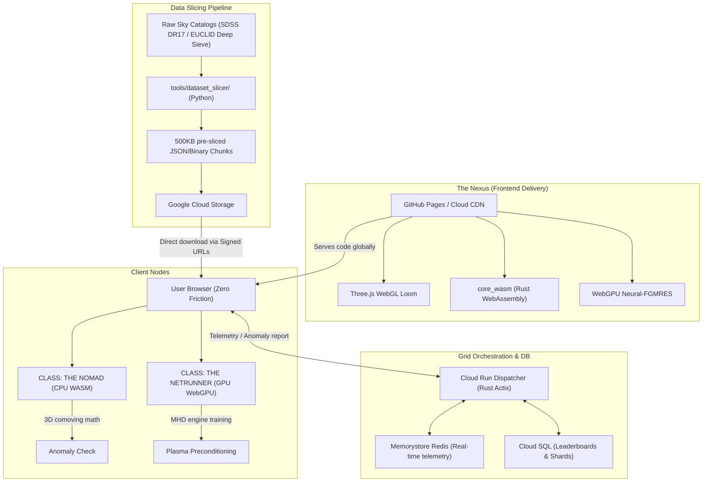

# S21 DarK3CosmicWeb@Home (Codename: NEON K3)
## Project Rosetta: Cosmic Web TDA Sieve & Visual Loom

> "SETI@home taught us to listen for the whispers of others. S21 DarK3CosmicWeb@Home teaches us to see the invisible architecture of reality itself. By crowdsourcing the dormant computational power of Earth's browsers, we are building a decentralized, planet-scale supercomputer to hunt for the $S_{1,2}$ topological signatures of Dark Energy."

---

## 🏛️ System Pipeline Architecture

```mermaid
flowchart LR
    subgraph DataIngestion ["1. Data Ingestion (Agent Empirica)"]
        SDSS["SDSS BOSS LRG (astroquery)"] --> CoordConv["Spherical to Cartesian Mpc"]
        Illustris["IllustrisTNG HDF5"] --> CalibGrid["Noiseless calibration grids"]
    end

    subgraph TopologicalSieve ["2. Mathematical Sieve (Agent Math)"]
        CoordConv --> PointCloud["3D point clouds"]
        PointCloud --> G-TDA["giotto-tda (Persistent Homology)"]
        G-TDA --> GalaxyBarcode["Galaxy Barcodes (b0, b1, b2)"]

        K3Equation["S1,2 Picard-Fuchs Operators"] --> NumericIntegration["Numeric Path Continuation in C²"]
        NumericIntegration --> KnotBarcode["Algebraic Knot Barcodes"]

        GalaxyBarcode & KnotBarcode --> Wasserstein["Wasserstein Distance Validation"]
    end

    subgraph VisualLoom ["3. WebGL Visualizer (Agent Méliès)"]
        Wasserstein --> JSONState["rosetta_state.json"]
        JSONState --> ThreeJS["Three.js WebGL Renderer"]
        ThreeJS --> Shaders["Custom Shaders: Neon Cyan (Galaxies) & Neon Gold (K3 Knot)"]
        Shaders --> ThreeAct["3-Act Narrative Camera Sequencer"]
    end

    subgraph Outreach ["4. Engagement (Zebroloss Pitch)"]
        ThreeAct --> Pages["GitHub Pages / Firebase Hosting"]
        Pages --> Sébastien["Interactive Outreach Handshake"]
    end
```

---

## 📂 Subsystems & Repository Structure

### 🛠️ 1. Core WebAssembly Engine (`core_wasm/`)
* **Mathematical & Physical Algorithms**: Implements the comoving distance conversion from astronomical redshift ($z$), 3D nearest-neighbor search optimized for CPU WebAssembly, and the Picard-Fuchs $S_{1,2}$ recurrence relation verification checker to identify clusters.
* **WASM-pack Integration**: Boots up a Rust library compiled to high-speed WebAssembly with multi-threading support (via Web Workers) and a strict < 64MB memory footprint.

### ⚡ 2. WebGPU Netrunner Compute Engine (`ui_loom/src/compute/`)
* **Direct-to-metal Parallel Computations**: Uses WGSL (WebGPU Shading Language) compute shaders to execute high-dimensional matrix-vector multiplications on client GPUs.
* **Neural-FGMRES Preconditioning**: Trains neural network preconditioners in parallel to accelerate Magnetohydrodynamic (MHD) plasma simulation steps, boosting the performance of the stellarator reactor calculations.

### 🎨 3. Cyberpunk WebGL Frontend (`ui_loom/`)
* **The Cosmic Loom**: An interactive Three.js 3D canvas displaying galaxies, filaments, and voids mapping the cosmic web. Custom GLSL shaders flash the screen in Gold concentric rings upon detecting a verified $S_{1,2}$ expansion anomaly.
* **The Netrunner Terminal**: A dashboard highlighting real-time matrix throughput, scrolling command logs, loss rates, and node telemetry using reactive charts.

---

## 🚀 How It Works: The "Hyper-Grid"

The infrastructure is entirely serverless, elastic, and highly distributed to handle millions of concurrent nodes:

---

## 🛠️ Getting Started

Check out the following planning documents to see our development roadmap and implementation details:

*   📖 **[IMPLEMENTATION_PLAN.md](file:///home/callensxavier_gmail_com/SocrateAI-Scientific-Agora-Home/IMPLEMENTATION_PLAN.md)** - Details on SDSS coordinate conversion, giotto-tda persistent homology, Picard-Fuchs continuation in $\mathbb{C}^2$, and WebGL custom shaders.
*   🗺️ **[ROADMAP.md](file:///home/callensxavier_gmail_com/SocrateAI-Scientific-Agora-Home/ROADMAP.md)** - Milestone targets, backend API definitions, security models, and client load-balancing strategies.
*   📋 **[TODO.md](file:///home/callensxavier_gmail_com/SocrateAI-Scientific-Agora-Home/TODO.md)** - Specific engineering-level tasks categorized by sub-component.
