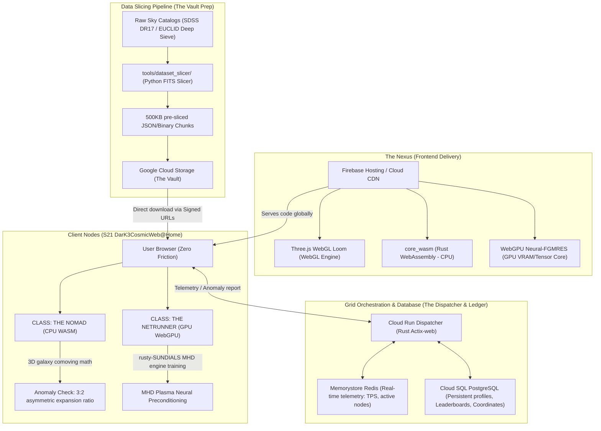

# S21 DarK3CosmicWeb@Home (Codename: NEON K3)
## Master Architectural Roadmap

> "SETI@home taught us to listen for the whispers of others. S21 DarK3CosmicWeb@Home teaches us to see the invisible architecture of reality itself. By crowdsourcing the dormant computational power of earth's browsers, we are building a decentralized, planet-scale supercomputer to hunt for the $S_{1,2}$ topological signatures of Dark Energy."

---

## 🏛️ I. Architectural Blueprint: The GCP "Hyper-Grid"

To survive the **Zebroloss Hug of Death** (hundreds of thousands of concurrent users joining within hours of a media or video drop), the infrastructure is completely serverless, elastic, and highly distributed.



### 1. The Nexus (Frontend)
* **Hosting**: Hosted on **Firebase Hosting & Cloud CDN** for global static asset distribution with sub-millisecond latencies.
* **Payload**: Serves a single-page reactive shell containing the **Three.js WebGL engine** and the compiled **Rust WebAssembly (WASM)** and **WebGPU** compute payloads.

### 2. The Dispatcher (Backend)
* **Orchestration**: Deployed on **Google Cloud Run** using a high-throughput **Rust / Actix-web** microservice.
* **Responsibility**: Manages client registrations, real-time node handshakes, telemetric aggregation, and anomaly verification. Scales seamlessly from **0 to 10,000 instances** in seconds to absorb sudden spikes in user activity.

### 3. The Vault (Data Storage)
* **Storage**: **Google Cloud Storage (GCS)** containing raw astronomical data.
* **Distribution**: Converts multi-terabyte **FITS files** into uniform **500KB JSON/Binary chunks** using a Python-based preprocessing slicer (`tools/dataset_slicer/`). 
* **Optimized Routing**: Client browsers download the data chunks directly from GCS buckets using **signed, short-lived URLs** generated by the Dispatcher, bypassing backend bottlenecks entirely.

### 4. The Ledger (Database & Telemetry)
* **Database**: **Cloud SQL (PostgreSQL)** for user profiles, real-time leaderboards, completed shards, and cryptographic coordinate receipts of found anomalies.
* **Cache & Live Feed**: **Google Cloud Memorystore (Redis)** for high-speed tracking of active global nodes, aggregate Transactions-Per-Second (TPS), and real-time visualization streams.

---

## 📂 II. The Cosmic Campaigns (Data Shards)

The platform distributes raw physical telemetry to the distributed browser nodes across two primary observational campaigns:

### Campaign 1: ARCHIVE 01 – SDSS DR17 (The Cosmic Skeleton)
* **Scientific Focus**: 3D spatial mapping of local galaxies using the Sloan Digital Sky Survey.
* **WASM Computation**: Converts galaxy redshift ($z$) to comoving distance in megaparsecs ($Mpc$) and computes 3D nearest-neighbor distance matrices.
* **Anomaly Sieve (Win Condition)**: Identifies 3D galaxy clusters matching the **asymmetric 3:2 cosmological expansion ratio** predicted by the Picard-Fuchs $S_{1,2}$ geometry.

### Campaign 2: ARCHIVE 02 – EUCLID Deep Sieve (The Cosmic Flesh)
* **Scientific Focus**: High-precision weak gravitational lensing shears compiled by the European Space Agency's Euclid telescope.
* **WASM/WebGPU Computation**: Evaluates local distortions of background galaxies ($\gamma_1, \gamma_2$ cosmic shear tensors) caused by foreground invisible mass.
* **Anomaly Sieve (Win Condition)**: Pinpoints spatial coordinates where the gravitational lensing footprint is strictly **asymmetric**, pointing to a localized **Chameleon Gravitino knot** (which shields K3 axions from superradiant black hole spin-down).

---

## 🕹️ III. Player Classes (Execution Engines)

The frontend automatically inventories the client's hardware capabilities, offering two highly stylized cyberpunk execution options:

| Attribute | 🛠️ CLASS: THE NOMAD | ⚡ CLASS: THE NETRUNNER |
| :--- | :--- | :--- |
| **Target Hardware** | Smartphones, ultra-portables, laptops, standard PCs | High-end gaming PCs, workstation rigs, dedicated GPUs |
| **Compute Engine** | **Rust to WebAssembly (WASM)** (CPU-bound multithreading) | **WebGPU** (Direct VRAM and Tensor/Matrix Core access) |
| **Mathematical Task** | SDSS distance calculations & weak lensing shear tensors | MHD Plasma training loops for `rusty-SUNDIALS` |
| **Visualizer** | **The Cosmic Loom**: Three.js WebGL canvas displaying stars and galaxy clusters dynamically construction on-screen | **MHD Plasma Reactor Visualizer**: High-octane heat maps, real-time tensor loss curves, and stellarator stability metrics |
| **User Vibe** | "A meditative, visually stunning background tab that maps the universe while you work." | "High-octane terminal shell, command-line analytics, raw compute injection." |

---

## 🏆 IV. Gamification & The Cyber-Guild

To engage, educate, and retain the global citizen science community, the platform incorporates deep structural game design:

### 1. The Bounty Board (Global Leaderboards)
* Track contributions via **"Tera-Flops Contributed"** and **"Sectors Swept"**.
* Facilitate competitive cooperative team play by allowing users to form or join **Cyber-Guilds** (e.g., *Squad Zebroloss* vs. *Squad Lisoir*).

### 2. Topological Achievements
* **First Blood**: Automatically awarded upon successfully processing the first 1,000 Euclid galaxies.
* **The Golden Ratio**: Unlocked by the exact client node that detects a verified $S_{1,2}$ or $S_{2,1}$ topological anomaly.
* **Plasma Weaver**: Awarded to Netrunners who contribute over 100 cumulative compute hours to the `rusty-SUNDIALS` MHD neural network solver.

### 3. The Legacy Chain
* When scientific papers are published by the **SocrateAI Open Lab**, the appendix will include a persistent cryptographic hash containing the registered usernames of all citizen scientists whose browser nodes contributed to the discovery.

---

## 🗺️ V. Development Phases & Milestones

```
Phase 1: WASM Core     Phase 2: Hyper-Grid    Phase 3: Cyber-UI      Phase 4: Gamification   Phase 5: Global Launch
  [Month 1]               [Month 2-3]           [Month 3-4]             [Month 4-5]             [Month 5-6]
     │                       │                     │                       │                       │
     ├─ Port K3 math to      ├─ Deploy Cloud Run   ├─ Integrate Three.js   ├─ Build Bounty Board   ├─ Load testing
     │  Rust core_wasm          Dispatcher            "Cosmic Loom"           Leaderboard          │  (Zebroloss test)
     ├─ Compile WASM target  ├─ Setup GCS bucket   ├─ Build WebGPU         ├─ Achievement system   ├─ Public launch
     └─ Create dataset_slicer   Signed URLs           Netrunner Engine     └─ Legacy Chain hash    └─ Start live
        FITS preprocessor    └─ Setup PostgreSQL      MHD training logs       generation pipeline     Falsification
```

### Phase 1: WASM Engine Core & Slicer (Porting the Physics)
* **Goal**: Build the local math core and preprocessing tools.
* **Deliverables**:
  - `core_wasm` Rust crate implementing SDSS comoving math and Euclid shear tensor mapping.
  - Integration of `DarkMatter` K3 candidate structures into Rust logic.
  - Python-based `dataset_slicer` that reads astronomical FITS files and outputs indexed 500KB JSON chunks.

### Phase 2: Hyper-Grid Serverless Infrastructure
* **Goal**: Construct the highly elastic GCP backend.
* **Deliverables**:
  - Cloud Run auto-scaling Actix-web Dispatcher backend.
  - Cloud Storage Vault with signed URL generator.
  - PostgreSQL Ledger schemas for user profiles and anomaly coordinates.
  - Redis cache mapping live global nodes, telemetry, and active worker count.

### Phase 3: The Cyberpunk UI (Loom & Netrunner Console)
* **Goal**: Design a premium, stunning frontend experience with smooth visual feedback.
* **Deliverables**:
  - **The Cosmic Loom (WebGL)**: Three.js engine dynamically plotting 3D galaxy clusters as shards complete.
  - **The Netrunner Terminal**: WebGPU training console showing real-time plasma simulation losses, tensor heatmap frames, and hardware metrics.
  - Responsive Cyberpunk design system (Neon gold/cyan accents, dark glassmorphic panels, custom typography).

### Phase 4: Gamification & The Legacy Chain
* **Goal**: Build the player rewards and peer-reviewed verification protocols.
* **Deliverables**:
  - Real-time Redis-backed Bounty Board leaderboard.
  - Achievement badge verification system using cryptographic task receipts.
  - Cryptographic hash pipeline that maps completed task IDs to usernames to generate the **Legacy Chain** for scientific papers.

### Phase 5: Planetary Load-Test & Public Launch
* **Goal**: Scale-out testing and community activation.
* **Deliverables**:
  - Simulate "Zebroloss Hug of Death" with 100,000 concurrent virtual browser clients downloading chunks.
  - Deploy final production build to Firebase Hosting / Cloud CDN.
  - Public launch and initiation of the physical K3/S12 Dark Energy candidate validation campaign.

---

## 🐙 VI. Git Repository Structure

```
agora2home/
├── core_wasm/           # Rust-to-WebAssembly compute engine
│   ├── Cargo.toml       # Pulls math logic from 'DarkMatter' & 'rusty-SUNDIALS'
│   └── src/
│       ├── lib.rs       # WASM entry points and Web workers mapping
│       ├── sdss.rs      # Archive 01: Comoving coordinates and 3:2 matrix checks
│       └── euclid.rs    # Archive 02: Weak lensing shear tensor calculations
├── ui_loom/             # Cyberpunk WebGL Frontend (Vite + TS + Three.js + Tailwind)
│   ├── src/
│   │   ├── components/  # WebGL Loom, Netrunner Console, Leaderboards, Guilds
│   │   ├── assets/      # Audio feedback, custom fonts, textures
│   │   └── main.js
│   └── package.json
├── gcp_infrastructure/  # Terraform configurations for production deployment
│   ├── main.tf          # Cloud Run, Cloud Storage, Cloud SQL, Redis configs
│   └── variables.tf
└── tools/
    └── dataset_slicer/  # Python script to convert massive FITS files into JSON chunks
        ├── slice.py
        └── requirements.txt
```
