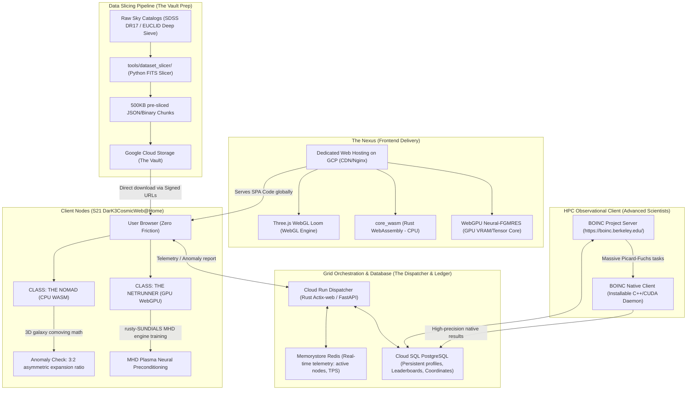

# S21 DarK3CosmicWeb@Home (Codename: NEON K3)
## Master Architectural Roadmap

> "SETI@home taught us to listen for the whispers of others. S21 DarK3CosmicWeb@Home teaches us to see the invisible architecture of reality itself. By crowdsourcing the dormant computational power of earth's browsers and native computers, we are building a decentralized, planet-scale supercomputer to hunt for the $S_{1,2}$ topological signatures of Dark Energy."

---

## 🏛️ I. Architectural Blueprint: The GCP "Hyper-Grid"

To survive the **Zebroloss Hug of Death** (hundreds of thousands of concurrent users joining within hours of a media or video drop), the infrastructure is designed to be completely serverless, elastic, and highly distributed. 



### 1. The Nexus (Frontend)
* **Web Hosting**: Served via **Dedicated Web Hosting on GCP (Cloud CDN & Nginx)** to deliver the single-page application (SPA) globally with sub-millisecond latencies.
* **Payload**: Delivers a lightweight, premium reactive shell containing the **Three.js WebGL engine**, the pre-compiled **Rust WebAssembly (WASM)** compute payload, and **WebGPU** browser workers.

### 2. The Dispatcher (Backend)
* **Orchestration**: Deployed on **Google Cloud Run** using a high-throughput, containerized backend microservice (implemented via containerized Python/FastAPI or Rust/Actix-web).
* **Responsibility**: Coordinates client connections, telemetry synchronization, leaderboard calculations, and cryptographic coordinate receipt uploads. Automatically auto-scales from **0 to 10,000 instances** to handle massive media drops.

### 3. The Vault (Data Storage)
* **Storage**: **Google Cloud Storage (GCS)** containing raw sky observations.
* **Distribution**: Converts multi-terabyte sky catalogs (FITS format) into compact, uniform **500KB JSON/Binary chunks** using a python preprocess utility (`tools/dataset_slicer/`). 
* **Optimized Routing**: Client browsers download pre-indexed chunks directly from GCP Storage buckets using **signed, short-lived URLs** to keep VM ingress/egress costs to a minimum.

### 4. The Ledger (Database & Telemetry)
* **Database**: **Cloud SQL (PostgreSQL)** for user profiles, Cyber-Guild standings, completed database shards, and cryptographic coordinate hashes of identified anomalies.
* **Cache & Live Feed**: **Google Cloud Memorystore (Redis)** for high-speed tracking of active global nodes, transactions-per-second (TPS), and live dashboard telemetry.

---

## 📂 II. The Cosmic Campaigns (Data Shards)

The platform distributes raw physical telemetry to the distributed browser nodes across two primary observational campaigns:

### Campaign 1: ARCHIVE 01 – SDSS DR17 (The Cosmic Skeleton)
* **Scientific Focus**: 3D spatial mapping of local galaxies using the Sloan Digital Sky Survey.
* **WASM Computation**: Converts galaxy redshift ($z$) to comoving distance in megaparsecs ($Mpc$) and computes 3D nearest-neighbor distance matrices.
* **Anomaly Sieve (Win Condition)**: Identifies 3D galaxy clusters matching the **asymmetric 3:2 cosmological expansion ratio** predicted by the Picard-Fuchs $S_{1,2}$ geometry.

### Campaign 2: ARCHIVE 02 – EUCLID Deep Sieve (The Cosmic Flesh)
* **Scientific Focus**: High-precision weak gravitational lensing shears compiled by the European Space Agency's Euclid telescope.
* **WASM/WebGPU Computation**: Evaluates local distortions of background galaxies ($\gamma_1, \gamma_2$ cosmic shear tensors) caused by foreground invisible mass.
* **Anomaly Sieve (Win Condition)**: Pinpoints spatial coordinates where the gravitational lensing footprint is strictly **asymmetric**, pointing to a localized **Chameleon Gravitino knot** (which shields K3 axions from superradiant black hole spin-down).

---

## 🕹️ III. Player Classes (Execution Engines)

The frontend automatically inventories the client's hardware capabilities, offering two highly stylized cyberpunk execution options:

| Attribute | 🛠️ CLASS: THE NOMAD | ⚡ CLASS: THE NETRUNNER |
| :--- | :--- | :--- |
| **Target Hardware** | Smartphones, ultra-portables, laptops, standard PCs | High-end gaming PCs, workstation rigs, dedicated GPUs |
| **Compute Engine** | **Rust to WebAssembly (WASM)** (CPU-bound multithreading) | **WebGPU** (Direct VRAM and Tensor/Matrix Core access) |
| **Mathematical Task** | SDSS distance calculations & weak lensing shear tensors | MHD Plasma training loops for `rusty-SUNDIALS` |
| **Visualizer** | **The Cosmic Loom**: Three.js WebGL canvas displaying stars and galaxy clusters dynamically construction on-screen | **MHD Plasma Reactor Visualizer**: High-octane heat maps, real-time tensor loss curves, and stellarator stability metrics |
| **User Vibe** | "A meditative, visually stunning background tab that maps the universe while you work." | "High-octane terminal shell, command-line analytics, raw compute injection." |

---

## 🏆 IV. Gamification & The Cyber-Guild

To engage, educate, and retain the global citizen science community, the platform incorporates deep structural game design:

### 1. The Bounty Board (Global Leaderboards)
* Track contributions via **"Tera-Flops Contributed"** and **"Sectors Swept"**.
* Facilitate competitive cooperative team play by allowing users to form or join **Cyber-Guilds** (e.g., *Squad Zebroloss* vs. *Squad Lisoir*).

### 2. Topological Achievements
* **First Blood**: Automatically awarded upon successfully processing the first 1,000 Euclid galaxies.
* **The Golden Ratio**: Unlocked by the exact client node that detects a verified $S_{1,2}$ or $S_{2,1}$ topological anomaly.
* **Plasma Weaver**: Awarded to Netrunners who contribute over 100 cumulative compute hours to the `rusty-SUNDIALS` MHD neural network solver.

### 3. The Legacy Chain
* When scientific papers are published by the **SocrateAI Open Lab**, the appendix will include a persistent cryptographic hash containing the registered usernames of all citizen scientists whose browser nodes contributed to the discovery.

---

## 🗺️ V. Development Phases & Milestones

```
Phase 1: Streamlit PoC   Phase 2: WASM Core      Phase 3: Cyber-UI      Phase 4: Gamification   Phase 5: Advanced (BOINC)
  [Deployed - Current]     [Month 1-2]            [Month 2-3]            [Month 3-4]             [Month 4-5]
     │                       │                      │                      │                       │
     ├─ Streamlit Front-end  ├─ Package Rust core   ├─ Init Vite/Next web  ├─ Cryptographic hash   ├─ Build C++ BOINC
     ├─ FastAPI Dispatcher   │  math solvers        │  frontend + WebGL    │  anomaly verification │  worker daemon
     ├─ Cloud SQL Database   ├─ Compile Rust targets├─ Build WebGPU        ├─ Form Cyber-Guilds    ├─ Setup boinc.berkeley
     └─ T4 PyTorch VM        │  via wasm-pack       │  compute pipeline    └─ Scientific Legacy    │  project server
        Worker (Offline)     └─ Setup GCP Server    └─ Fed Orchestration      Chain Appendix       └─ High-performance
                                dedicated host         via Cloud Run API                              HPC validation
```

### Phase 1: Streamlit PoC & Baseline (Fully Deployed)
* **Goal**: Build the primary backend data ingestion pipelines and launch an interactive Python dashboard to validate SDSS/Euclid mathematical formulas, data integrity, and basic GCP cloud integration.
* **Deliverables**:
  - Live interactive dashboard hosted at **Streamlit Cloud** (`https://darkmatterk3athome.streamlit.app/`).
  - Active PostgreSQL relational ledger and Memorystore Redis cache.
  - PyTorch-based T4 GPU background VM execution worker (`t4_worker.py`).
  - Containerized FastAPI dispatch handler (`api_dispatcher.py`) running on Google Cloud Run.

### Phase 2: WASM Engine Core & Dedicated GCP Web Host (WASM Compilation)
* **Goal**: Port the physics, TDA solver, and cosmic coordinate transformations into a high-performance Rust core, ready for browser deployment.
* **Deliverables**:
  - `core_wasm` Rust crate implementing SDSS comoving math and Euclid shear tensor calculations.
  - Setup of a high-efficiency GCP Web Server (via Nginx or GCP Cloud CDN) dedicated to serving static WASM and WebGPU JS modules.
  - Compile-pipeline mapping the core math to optimized WebAssembly targets using `wasm-pack` with active multi-threading support.
  - Python-based FITS `dataset_slicer` to pre-package sky archives into indexable 500KB JSON files.

### Phase 3: The Cyber-UI & Browser Federated Computing (Web Frontend Migration & Orchestration)
* **Goal**: Transition from a server-side dashboard to a client-side, zero-friction, browser-driven federated network.
* **Deliverables**:
  - **Modern Premium Frontend (Vite/React/Next.js)**: Build a responsive, highly-stylized cyber-design shell.
  - **The Cosmic Loom (WebGL)**: Three.js engine dynamically rendering 3D galaxy clusters as coordinate files complete.
  - **The Netrunner Terminal (WebGPU)**: Direct browser VRAM matrix context pipelines executing weak lensing shear contractions and real-time stellarator loss metrics locally.
  - **Federated Orchestration**: Clients download chunks directly from Cloud Storage, run local calculations, and push cryptographic receipts back to Cloud Run, reducing VM computing costs by up to 95%.

### Phase 4: Gamification, Cyber-Guilds & Legacy Chain
* **Goal**: Launch community retention modules and secure, cheat-proof computation check-in mechanisms.
* **Deliverables**:
  - Live Redis-backed leaderboard supporting customizable teams/Cyber-Guilds.
  - Cryptographic validation of results using spot-checking algorithms to prevent malicious or spoofed anomaly submissions.
  - **Legacy Chain Generator**: Automate the generation of cryptographic hashes linking completed task sequences to user accounts for research publications.

### Phase 5: Advanced Observational Platform (BOINC Integration)
* **Goal**: Bridge browser-based click-and-run audiences with the high-performance computing (HPC) scientific community.
* **Deliverables**:
  - **Native C++/CUDA Compute Client**: Build a dedicated, installable native client for Windows, Linux, and macOS supporting advanced GPU instruction sets.
  - **BOINC Project Server**: Configure and launch a dedicated registration node on the **Berkeley Open Infrastructure for Network Computing (BOINC)** platform (`https://boinc.berkeley.edu/`).
  - **Federated Bridge**: Allow advanced researchers and extreme-scale users to run background daemons with full hardware allocation, solving complex Picard-Fuchs curves and large-scale cosmic simulations that exceed browser sandbox limits.

---

## 🐙 VI. Git Repository Structure

```
agora2home/
├── api/                 # Phase 1: FastAPI dispatcher for Cloud Run
├── frontend/            # Phase 1: Streamlit dashboard and localized UI elements
├── core_wasm/           # Phase 2/3: Rust-to-WebAssembly compute engine (Browser-side CPU)
│   ├── Cargo.toml       # Pulls math logic from 'DarkMatter' & 'rusty-SUNDIALS'
│   └── src/
│       ├── lib.rs       # WASM entry points and Web workers mapping
│       ├── sdss.rs      # Archive 01: Comoving coordinates and 3:2 matrix checks
│       └── euclid.rs    # Archive 02: Weak lensing shear tensor calculations
├── core_boinc/          # Phase 5: Native C++/CUDA compute client for advanced scientists
│   ├── src/             # Heavyweight solvers for Picard-Fuchs curve tracking
│   └── project_xml/     # BOINC project and workunit XML configurations
├── ui_loom/             # Phase 2/3: Cyberpunk WebGL Frontend (Vite + TS + Three.js + Vanilla CSS)
│   ├── src/
│   │   ├── components/  # WebGL Loom, Netrunner Console, Leaderboards, Guilds
│   │   ├── assets/      # Audio feedback, custom fonts, textures
│   │   └── main.js
│   └── package.json
├── gcp_infrastructure/  # Terraform configurations for production deployment
│   ├── main.tf          # Cloud Run, Cloud Storage, Cloud SQL, Redis, and Web Server configs
│   └── variables.tf
└── tools/
    └── dataset_slicer/  # Python script to convert massive FITS files into JSON chunks
        ├── slice.py
        └── requirements.txt
```
