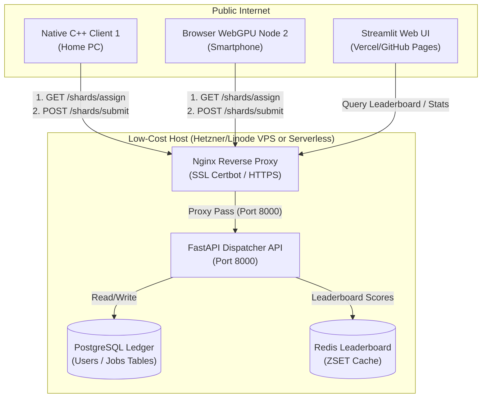

# 🌐 Low-Cost, Independent BOEINC Server Deployment Plan
**Project: S21 DarK3CosmicWeb@Home (Codename: NEON K3)**  

---

## 🎯 1. Objective

To transition the BOEINC coordination server from the current high-cost Google Cloud Platform (GCP) enterprise infrastructure (costing ~$400/month if always-on) to an **independent, highly affordable ($0 to $6/month), always-on federated server**. 

This server will stay active 24/7, allowing decentralized client nodes to download workunit shards, process them, and upload verification receipts without requiring a GCP account or expensive Cloud SQL/Memorystore dependencies.

> [!IMPORTANT]
> **Key Architecture Insight:** The central BOEINC server **does not need a GPU** or high-performance CPU. Its sole responsibility is to act as a *dispatcher* (serving 500KB coordinates shards, storing receipts, and updating a scoreboard ledger). The actual heavy 3D FFT and topological calculations are performed entirely on the **client side** (using their local CPU/GPU/WebGPU). Thus, we can safely host the server on ultra-low-cost, lightweight hardware.

---

## 🏗️ 2. Proposed Low-Cost Architectures

We present two independent, budget-friendly deployment options depending on your preference for server management:

### 🏆 Option A: The "Zero-Dollar" Serverless Hybrid (Cost: $0.00 / month)
By utilizing developer free tiers across dedicated managed cloud services, we can host the entire BOEINC backend at **zero cost** while maintaining high availability:

* **FastAPI Dispatcher Backend:** Hosted on **Render.com** (Free Instance) or **Fly.io** (3 shared CPUs, 256MB RAM free tier).
* **Database (PostgreSQL Ledger):** Hosted on **Supabase.com** or **Neon.tech** (Free Tier: 500MB SSD, unlimited connections, fully managed PostgreSQL).
* **Cache (Redis Leaderboard):** Hosted on **Upstash.com** (Free Tier: 10,000 requests/day, fully managed Redis).
* **Static Assets (Streamlit Dashboard / Web Visualizer):** Hosted on **GitHub Pages** (Free) or **Vercel** (Free).

### 🖥️ Option B: Self-Hosted Budget VPS (Cost: $4.00 - $6.00 / month)
A single, independent Virtual Private Server (VPS) hosted with a developer-friendly budget provider. This encapsulates all services (PostgreSQL, Redis, FastAPI, Nginx) inside light Docker containers on a single host:

* **Hetzner Cloud (Germany/Finland):** **CX11 Instance** (€3.29/mo $\approx$ $3.60/mo) or **CX21** (€5.39/mo) — 1-2 vCPUs, 2-4GB RAM, 20GB NVMe SSD, 20TB traffic.
* **DigitalOcean Droplet:** Basic Droplet ($4.00 - $6.00/mo) — 1 vCPU, 512MB-1GB RAM, 10-25GB SSD.
* **Linode (Akamai):** Shared Nanode ($5.00/mo) — 1 vCPU, 1GB RAM, 25GB SSD.

### ☁️ Option C: Cost-Optimized GCP VM (Cost: ~$13.00 - $16.00 / month)
If you prefer to stay entirely within Google Cloud Platform (GCP) but keep costs strictly below your $50/month threshold:
* **Compute VM (e.g., e2-small):** Deploy an always-on **`e2-small` instance** (2 vCPUs, 2GB RAM) in a cost-effective region (e.g. `us-central1` or `europe-west1`), which costs about **$13.00/month**. 
* **Database & Cache (Dockerized on VM):** Instead of paying for expensive managed GCP services like Cloud SQL ($45+/mo) and Cloud Memorystore ($35+/mo), we run **PostgreSQL** and **Redis** inside lightweight Docker containers on the `e2-small` VM itself. This incurs **$0.00/month** additional cost!
* **Boot Disk:** Use a 30GB standard balanced persistent disk (balanced PD) costing about **$3.00/month**.
* **Total GCP Cost:** **~$16.00 / month** (well below the $50 limit).

---

## 📊 3. System Architecture Diagram

This diagram shows how public clients connect to the low-cost server and how results are federated securely:



---

## 🛠️ 4. Step-by-Step Deployment Guide (Option B: VPS)

Below is the concrete blueprint to deploy the BOEINC server on an independent $4 Hetzner/DigitalOcean Ubuntu 24.04 VPS.

### Step 1: Initial VPS Server Setup & Security
1. Purchase a cheap VPS from your provider (e.g. Hetzner CX11 with Ubuntu 24.04).
2. SSH into your new server and update packages:
   ```bash
   sudo apt-get update && sudo apt-get upgrade -y
   sudo apt-get install -y docker.io docker-compose nginx certbot python3-certbot-nginx gitufw
   ```
3. Enable basic firewall protections:
   ```bash
   sudo ufw default deny incoming
   sudo ufw default allow outgoing
   sudo ufw allow ssh
   sudo ufw allow http
   sudo ufw allow https
   sudo ufw --force enable
   ```

### Step 2: Deploy Database & Cache (Dockerized)
Instead of expensive managed cloud DBs, run lightweight instances of PostgreSQL and Redis directly on the VPS. 

Create a `/app/docker-compose.yml` file:
```yaml
version: '3.8'

services:
  postgres:
    image: postgres:15-alpine
    container_name: boeinc-postgres
    restart: always
    environment:
      POSTGRES_DB: darkmatter
      POSTGRES_USER: postgres
      POSTGRES_PASSWORD: YourSuperSecureDockerPassword
    ports:
      - "127.0.0.1:5432:5432"  # Exposed only locally for security
    volumes:
      - pgdata:/var/lib/postgresql/data

  redis:
    image: redis:7-alpine
    container_name: boeinc-redis
    restart: always
    ports:
      - "127.0.0.1:6379:6379"  # Exposed only locally
    volumes:
      - redisdata:/data

volumes:
  pgdata:
  redisdata:
```
Launch the databases in background:
```bash
sudo docker-compose -f /app/docker-compose.yml up -d
```

### Step 3: Initialize Database Schema
Create the tables in PostgreSQL. Connect to the local Postgres container:
```bash
sudo docker exec -it boeinc-postgres psql -U postgres -d darkmatter
```
Execute the standard schema:
```sql
CREATE TABLE IF NOT EXISTS users (
    user_id VARCHAR(100) PRIMARY KEY,
    username VARCHAR(100) NOT NULL,
    score INTEGER DEFAULT 0,
    chunks_processed INTEGER DEFAULT 0,
    created_at TIMESTAMP DEFAULT CURRENT_TIMESTAMP
);

CREATE TABLE IF NOT EXISTS jobs (
    job_id VARCHAR(100) PRIMARY KEY,
    status VARCHAR(50) DEFAULT 'pending',
    assigned_to VARCHAR(100) REFERENCES users(user_id) ON DELETE SET NULL,
    chunk_data JSONB,
    result_data JSONB,
    completed_at TIMESTAMP
);

CREATE TABLE IF NOT EXISTS badges (
    id SERIAL PRIMARY KEY,
    user_id VARCHAR(100) REFERENCES users(user_id) ON DELETE CASCADE,
    badge_name VARCHAR(100) NOT NULL,
    awarded_at TIMESTAMP DEFAULT CURRENT_TIMESTAMP
);
```

### Step 4: Run the FastAPI Dispatcher Server
1. Clone the repository into `/app/code/`.
2. Configure `/app/code/.env` to point to the local Docker containers:
   ```ini
   DB_HOST="127.0.0.1"
   DB_NAME="darkmatter"
   DB_USER="postgres"
   DB_PASSWORD="YourSuperSecureDockerPassword"
   DB_PORT=5432
   REDIS_HOST="127.0.0.1"
   REDIS_PORT=6379
   API_URL="https://your-custom-domain.com"
   ```
3. Set up a systemd service file to run the FastAPI app as a background service:
   Create `/etc/systemd/system/boeinc-server.service`:
   ```ini
   [Unit]
   Description=BOEINC FastAPI Dispatcher Server
   After=network.target

   [Service]
   User=ubuntu
   WorkingDirectory=/app/code
   EnvironmentFile=/app/code/.env
   ExecStart=/usr/bin/uvicorn api.api_dispatcher:app --host 127.0.0.1 --port 8000 --workers 2
   Restart=always

   [Install]
   WantedBy=multi-user.target
   ```
4. Start the service:
   ```bash
   sudo systemctl daemon-reload
   sudo systemctl enable boeinc-server
   sudo systemctl start boeinc-server
   ```

### Step 5: Configure Nginx Reverse Proxy & SSL (HTTPS)
1. Point your domain (e.g. `boeinc.yourdomain.com`) to your VPS IP address in your DNS registrar.
2. Create Nginx config `/etc/nginx/sites-available/boeinc`:
   ```nginx
   server {
       listen 80;
       server_name boeinc.yourdomain.com;

       location / {
           proxy_pass http://127.0.0.1:8000;
           proxy_set_header Host $host;
           proxy_set_header X-Real-IP $remote_addr;
           proxy_set_header X-Forwarded-For $proxy_add_x_forwarded_for;
           proxy_set_header X-Forwarded-Proto $scheme;
       }
   }
   ```
3. Enable and test Nginx:
   ```bash
   sudo ln -s /etc/nginx/sites-available/boeinc /etc/nginx/sites-enabled/
   sudo nginx -t
   sudo systemctl restart nginx
   ```
4. Install SSL certificates securely with Certbot:
   ```bash
   sudo certbot --nginx -d boeinc.yourdomain.com --non-interactive --agree-tos --email your-email@gmail.com
   ```
Your BOEINC server is now **always-on, secure (HTTPS), and accessible globally**!

---

## 💻 5. Configuring Clients to Connect

Now that the server is independent, client nodes simply need to change their API configurations to pull shards and upload receipts.

### Native C++ Client Config
Update `/app/code/.env` (on any contributing client PC):
```ini
API_URL="https://boeinc.yourdomain.com"
```

### Browser-based Netrunner Nodes
When users open "The Cosmic Loom" website (hosted on Vercel or GitHub Pages), they input your server URL:
```javascript
const BOEINC_SERVER_URL = "https://boeinc.yourdomain.com";
```

---

## 💰 6. Infrastructure Cost & Resource Comparison

| Feature | Your GCP Stack (Current) | Self-Hosted VPS (Hetzner) | Serverless Hybrid (Supabase) | Cost-Optimized GCP VM (Option C) |
| :--- | :---: | :---: | :---: | :---: |
| **Central Host VM** | $0.564/hr (~$400/mo) | **$3.60 / mo** (always-on) | **$0.00 / mo** | **$13.00 / mo** (always-on e2-small) |
| **PostgreSQL Database** | GCP Cloud SQL ($45+/mo) | **Free** (Local Docker) | **$0.00 / mo** (Supabase Free) | **Free** (Local Docker on VM) |
| **Redis Cache** | Memorystore Redis ($35+/mo) | **Free** (Local Docker) | **$0.00 / mo** (Upstash Free) | **Free** (Local Docker on VM) |
| **Network Traffic** | $0.12 per GB | **20 TB Free** included | **Free** (capped at fair-use) | GCP free egress allowances |
| **Monthly Cost** | **~$480.00 / month** | **~$3.60 / month** | **$0.00 / month** | **~$16.00 / month** |
| **Account Owner** | Your Personal GCP | **Independent Registrar** | **Independent Dev Accounts** | **Your Personal GCP** |
| **Uptime / Availability** | Automated scheduling only | **99.9% Always-On** | **99.9% Always-On** | **99.9% Always-On** |

---

## 📈 7. Recommendations for Launch

1. **Deploy Option C (Cost-Optimized GCP VM) if staying on GCP is preferred.** This runs a lightweight always-on `e2-small` instance hosting Dockerized PostgreSQL and Redis. At **~$16.00/month**, it is well within your $50/month threshold, keeps your infrastructure unified on GCP, and provides complete 24/7 availability for clients.
2. **Deploy the "Zero-Dollar" Serverless Hybrid first** if you want a zero-maintenance, zero-cost configuration. Supabase and Render are rock-solid for crowdsourced academic projects.
3. **Use Hetzner Cloud VPS (Option B)** if you prefer complete independent server control with the absolute lowest self-hosted cost (~$3.60/month).
4. Keep the current high-performance GCP T4 instance as an **intermittent physics validator** that powers up occasionally to verify massive chunks, while the always-on server (Option C or A) coordinates the crowd!
