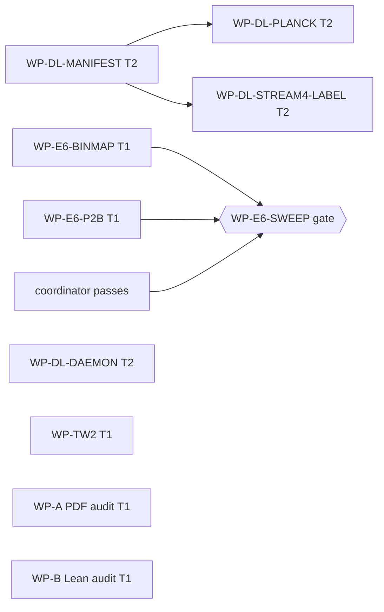

# Execution Plan — Datalake Governance & Dropped-WP Relaunch (2026-07-31)

**Status: PROPOSED — NOT LAUNCHED.** Awaiting T0 GO. No script below is deployed, no
daemon restarted, no agent started.
**Authority:** `T0_RATIFICATION_2026_07_31_DATALAKE.md` (DL-1…DL-5, all APPROVED).
**Model tiers** (canonical roster, EXECUTION_PLAN.md §1.1): **T1** = Sonnet-class (capable
worker) · **T2** = Haiku-class (bulk/mechanical). T0/T0s appear only as escalation
targets. Every WP runs **without worktree isolation** (standing lesson: worktrees break on
gitignored dirs and can root in the wrong repo) and with same-checkout git discipline
(check `git branch -vv` before committing; S2 HEAD may not be on `main`).

---

## Tier-assignment principle

**T2 (Haiku)** gets tasks that are *mechanical with a checkable output*: enumeration,
hashing, fetching against a known URL, file labeling, supervisor loops. The failure mode
Haiku must be guarded against is confident fabrication of statuses — so every T2 WP below
has an output the coordinator re-derives cheaply (re-run the script, re-hash a sample,
re-fetch a byte range).

**T1 (Sonnet)** gets tasks needing *judgment inside a fixed scope*: numerical
correspondence with prereg discipline (BINMAP, P2B), algebraic geometry within a ratified
family (TW2), and claims-vs-ledger auditing (WP-A, WP-B). The 2026-07-31 fabrication
finding is precisely why neither audit WP goes to T2.

Three-strikes ladder applies per stream rules: a T1 agent stuck after 3 distinct attempts
escalates to coordinator; coordinator escalates genuinely-blocked math to T0s (Deep
Think) only via T0.

---

## Work packages

### Wave 1 — T0's stated priorities (manifest + relaunches), all parallel

**WP-DL-MANIFEST — datalake manifest generator** · **T2 (Haiku)** · repo S3
- Write `scripts/audit_datalake.py`: enumerate every object in
  `gs://socrateai-datalake-gen-lang-client-0625573011/`; record byte size + GCS-side
  MD5/CRC32C; compute full SHA-256 (streamed download) for every object ≤ 500 MB tagged
  analysis-relevant; emit `data/GCS_DATALAKE_MANIFEST.md`.
- Status vocabulary (closed set): `PRESENT` / `AUDITED` (full-hash trail) / `QUARANTINED`
  / `ABSENT`. Seed rows fixed by ratification: Discovery PDF + lean_oracle_v5.tar.gz →
  QUARANTINED (A5: flag, don't delete); DES-Y3, Planck (until fetched), IPTA DR2,
  `proofs/GeneratedK3.lean` → ABSENT rows documenting the retracted 2026-07-31 claims;
  `stream4_bridge/` rows carry the EXPLORATORY SANDBOX header (A4).
- Hard constraints in the WP prompt: script must fail loudly (nonzero exit) on any
  unreachable object, never invent a hash, never emit "VERIFIED" (reserved word,
  AUDITED is the ceiling for machine output).
- **Verification (coordinator):** re-run script from clean shell → byte-identical
  manifest; independently re-hash 3 randomly chosen objects; confirm all seed rows.

**WP-E6-BINMAP (relaunch) — 9-bin restriction map + real DESI covariance** · **T1
(Sonnet)** · repo S3
- Scope verbatim from `dbf1337` D1 (annotation A1): build the exact map from the 9
  natively-resolved `K_BINS` (log₁₀k = −2.2…−1.4) into the real DESI DR1 P1D CSV's
  85 k-bin × 12 z-bin grid; extract the corresponding real published covariance
  sub-blocks. No interpolation across mismatched bins — intersection only.
- Deliverable: `briefs/WP_E6_BINMAP_RESULT_<date>.md` + code under `pipeline/` + tests
  under `pipeline/tests/` (merge-blocking). DRAFT label until coordinator pass.
- **Verification (coordinator):** independently recompute bin-edge membership for all 9
  bins at 3 redshifts; check covariance sub-block symmetry/positive-definiteness;
  cross-check against annotation A1 of `dbf1337` (max k = 0.0527412 s/km).

**WP-E6-P2B (relaunch) — χ² profiling design, 5 dof/cell** · **T1 (Sonnet)** · repo S3
- Scope verbatim from `dbf1337` D2: χ² design on the 9-bin covariance; 4 profiled
  nuisances (`zrei, ha, hs, taueff` per ANALYSIS_PROTOCOL §2.3) → 5 dof per (m,f) cell;
  Hartlap correction where the mock covariance is used for engineering validation
  (Hartlap et al. 2007).
- Depends on BINMAP only for the *real* covariance path; the design doc + synthetic-side
  implementation can proceed in parallel (declared interface: 9-bin vector + covariance).
- **Verification (coordinator):** dof arithmetic against the LIVE protocol; profile-
  likelihood implementation spot-checked on a synthetic cell with known optimum.

**WP-TW2 (relaunch) — M₁₉-polarization exhibition** · **T1 (Sonnet)** · repo S2
- Scope verbatim from `dbf1337` D5 + annotation A4 (inherited here as A1): explicit f, g
  sections supporting the M₁₉-polarization on the P¹-bundle-over-P² disjoint-section
  (C₀, C∞) configuration, n ≤ 18, **starting concretely at n = 0..3** before any general-n
  argument; target lattice NS ≅ U ⊕ E₈(−1) ⊕ E₈(−1) ⊕ ⟨−14⟩ cited from the S2 G0
  certificate, not restated from memory.
- Exhibition failure at all n ≤ 18 is a reportable result, not an error state.
- **Verification (coordinator):** re-run the agent's section-counting on one passing and
  one failing n; negative controls required in the deliverable.

**WP-DL-DAEMON — harvest daemon restart + staleness alarm** · **T2 (Haiku)** · repo S3
- Wrap `scripts/datalake_harvest.py` (existing, `79e9d09`) in a supervisor: relaunch on
  crash; write heartbeat; if `figures/live/last_harvest.json` age > 2× harvest period,
  emit a dated STALE alert file the resume-stream3 skill will surface. Backfill the
  checkpoint backlog since 2026-07-30 10:04 UTC on first run.
- **Verification (coordinator):** kill the daemon once, confirm supervisor restart;
  fast-forward the clock check (touch-date trick) to confirm the alarm fires.

### Wave 2 — quarantine audits (start after Wave 1 launches are stable)

**WP-A — Discovery-PDF claims audit** · **T1 (Sonnet)** · repo S3 (report), reads all 3
- Extract every quantitative/tiered claim from
  `publications/SocrateAI_K3_T2_Discovery_Final.pdf`; diff each against the three repos'
  epistemic ledgers. Mandatory flags: anything resting on cooper_s10/U⊕⟨20⟩ (not in any
  ledger), any empirical claim (sweep has not run), any Kodaira reading (E-008/E-009
  retraction), any Tier-C observable (F5b). Deliverable: audit table + per-claim verdict
  {LEDGER-SUPPORTED, UNSUPPORTED, RETRACTED-CONTRADICTING}.
- The PDF itself is not edited — it is another session's artifact; the audit report is
  the deliverable T0 uses to decide its fate.
- **Verification (coordinator):** independent re-check of every claim marked
  LEDGER-SUPPORTED (the dangerous direction).

**WP-B — Lean oracle audit** · **T1 (Sonnet)** · repo S1
- **Step 0 (gating):** locate auditable source — (a) inspect `lean_oracle_v5.tar.gz`
  contents for bundled `.lean` files; (b) search the Vertex session's uncommitted S3 dirs;
  (c) if neither yields source, STOP and report **UNVERIFIABLE — remains QUARANTINED,
  tier NONE** (ratification annotation A2: a valid outcome, not an error).
- If source found: build under the pinned S1 toolchain (`lake build`); `#print axioms`
  on every top-level theorem; verify the statements formalize the claimed Swampland
  conjectures (not stubs/trivialities); check against the S1 axiom-quarantine ledger;
  confirm the "0 sorry" property and state exactly which theorems it covers.
- **Verification (coordinator):** independent rebuild; axiom lists diffed against the
  agent's report.

**WP-DL-STREAM4-LABEL — sandbox designation propagation** · **T2 (Haiku)** · repos S2+S3
- Mechanical propagation per annotation A4: S3 CLAUDE.md ledger line; S2 decision-log
  entry; manifest header on `stream4_bridge/` rows (lands via WP-DL-MANIFEST seed). Exact
  wording fixed in the WP prompt from the ratification — no drafting latitude.
- **Verification (coordinator):** grep all three locations for the exact designation.

### Wave 3 — acquisition (after WP-DL-MANIFEST is live)

**WP-DL-PLANCK — Planck 2018 plik_lite acquisition (P1)** · **T2 (Haiku)**
- Fetch plik_lite foreground-marginalized TT/TE/EE bandpowers + covariance from the ESA
  Planck Legacy Archive → `gs://…/planck_2018/` staging; full SHA-256 into
  `GCS_DATALAKE_MANIFEST.md` (status AUDITED); record source URLs + retrieval date.
- **Does NOT enter `data/raw/`**, no fetch_data.py entry, per annotation A5 — staging
  only until a Planck channel amendment is pinned (DL-3).
- DES-Y3: **planned, not fetched** (annotation A3 interpretation) — a one-line T0 nudge
  flips it to a clone of this WP. IPTA DR2: no WP exists (struck).
- **Verification (coordinator):** re-hash fetched files; cross-check bandpower vector
  length and covariance dimension against Planck Collaboration V 2020 (A&A 641, A5).

### Continuous — coordinator-only (producer ≠ verifier; never delegated)

1. Verification pass on S1 paper sections 10a/10b + edits (Directive-3 agent's
   uncommitted work) — land or reject.
2. Verification pass on S2 `checkers/check_S2G_cooper_s10_trapcheck.py` (Directive-2
   agent; brief never written — treat as unverified draft); remove stray
   `CLAUDE.md.tmp.*` file.
3. Owed passes carried from 07-29/30: WP-E6-PIN (S3), WP-P1 (S1).
4. **WP-E6-SWEEP gate bookkeeping:** SWEEP remains gated on pin ✅ + BINMAP + P2B + a
   coordinator pass on each. The gate opens only by explicit coordinator statement citing
   the three verifications.

---

## Dependency graph

Parallelizable from t=0 on GO: MANIFEST, BINMAP, P2B, TW2, DAEMON (Wave 1 = T0's stated
priority order honored by launching manifest + relaunches first). Wave 2 starts once
Wave 1 agents are running stably; Wave 3 after the manifest exists to receive hashes.

## Failure/escalation rules

- Any T2 WP producing a status it cannot back with a hash/exit-code → coordinator kills
  and re-runs; repeated → reassign to T1. (2026-07-31 lesson: fabricated status tables.)
- TW2 stuck after 3 distinct attempts at n = 0 → coordinator review before any n > 3
  claim; genuinely blocked mathematics → T0 decides on a T0s (Deep Think) referral.
- WP-B step 0 failure is a *result* (UNVERIFIABLE), not an escalation.
- Any WP touching `data/raw/`, the pinned PREDICTION files, or emitting TEST labels:
  out of scope by construction — immediate stop + coordinator report (firewall, DL-1/DL-3).

---

**GO condition:** T0 replies GO (optionally amending tier assignments or A3's DES-Y3
interpretation). On GO, Wave 1 launches in parallel under the autonomy mandate with
per-milestone commit+push+brief.
